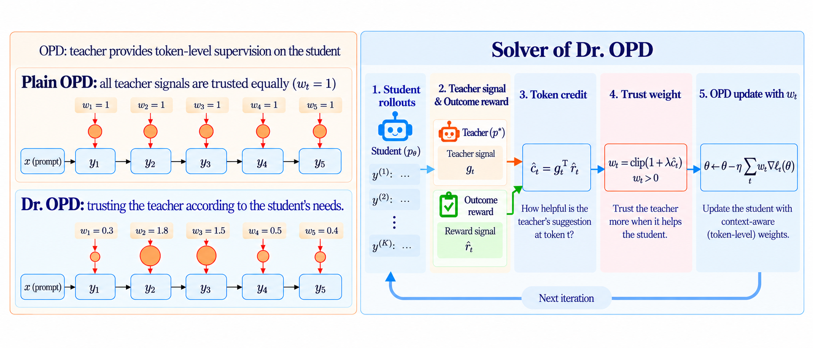
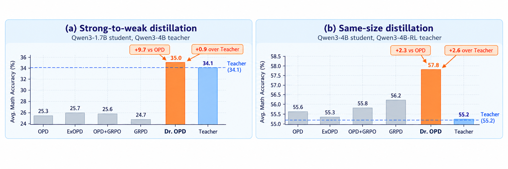

<div align="center">

# Dr. OPD （On-policy Distillation Done Right)

### Learning What to Follow for Optimal<br>On-Policy Distillation of Large Language Models

[Zhenyu Wang](https://zywang0701.github.io/)<sup>\*</sup> · Tianze Wang<sup>\*</sup> · [Linjun Zhang](https://linjunz.github.io/) · [Yifan Hu](https://sites.google.com/view/yifan-hu)

Department of Statistics, Rutgers University<br>
<sub>\* Equal contribution</sub>

<p>
  <a href="assets/paper.pdf"></a>
  <a href="#quick-start"></a>
  <a href="#results"></a>
</p>

**English** · [中文](README_zh.md)

[Introduction](#introduction) · [Results](#results) · [Quick Start](#quick-start) · [Reproduction](docs/reproduction.md) · [Citation](#citation)

</div>

## Introduction

On-policy distillation (OPD) provides dense, token-level teacher supervision on student-generated responses. Vanilla OPD assigns the same weight to every teacher signal, while **Dr. OPD** adapts the weights according to their usefulness for improving the student's performance. We formulate this as:

$$
\max_w \left\lbrace\text{Student's performance after training with } w\text{-weighted OPD}\right\rbrace.
$$

Here, $w$ is a weight function defined on every possible generated tokens.

Directly solving Dr. OPD exactly would require repeatedly training the student under different weight functions and then selecting the best weight, which is computationally infeasible. We develop an iterative solver: at each round, we update the weights in closed form, then take a gradient step on the resulting weighted OPD objective.

<p align="center">
  <a href="assets/figure1.png"></a>
  <br><sub><b>Figure 1.</b> Illustration of Dr. OPD.</sub>
</p>

## Results

Dr. OPD outperforms the evaluated baselines across strong-to-weak and same-size distillation on math and code. In strong-to-weak distillation, it improves Qwen3-1.7B's average math performance by **9.7 points** over vanilla OPD, surpassing its larger Qwen3-4B teacher (**35.0 vs. 34.1**).

<p align="center">
  <a href="assets/figure2.png"></a>
  <br><sub><b>Figure 2.</b> Empirical gains in strong-to-weak and same-size distillation.</sub>
</p>

The figure reports the manuscript's five-benchmark math average, using **avg@16**. Code results use **avg@4**. See [full results and evaluation protocol](docs/results.md).

## Quick Start

The current implementation provides the **math training pipeline**, with Dr. OPD and four baselines. The paper's code-generation experiments are documented in the [results](docs/results.md); dedicated code-generation launchers are not included in this snapshot.

### 1. Inspect the configuration — no GPU needed

From the repository root:

```bash
bash run.sh train ours --dry-run
```

This prints the launch configuration without creating an environment, querying GPUs, starting Ray, downloading models, or training.

### 2. Prepare the environment and data

The manuscript experiments use **one node with 8 × H100 GPUs**. The original code targets Linux, Python 3.11 and CUDA 12.x; allow approximately 60 GB for the environment, models and caches, plus checkpoint storage. A lower minimum GPU configuration has not been validated.

```bash
bash run.sh setup
```

Set the two prepared Parquet paths, then validate their row counts:

```bash
export TRAIN_DATASET=/path/to/deepmath-level6-train.parquet
export TEST_DATASET=/path/to/valid_final_unique.parquet
bash run.sh data
```

See [data preparation](docs/data.md) for the expected files, schema and provenance. Dataset binaries are not included in this repository.

### 3. Train

```bash
bash run.sh train ours
```

| Student | Teacher | Weighting strength | Training steps | Data seed |
| --- | --- | --- | --- | --- |
| Qwen3-1.7B | Qwen3-4B | λ = 0.4 | 50 | 2 |

See the [evaluation settings](docs/reproduction.md#evaluation) for checkpoint selection and benchmark aggregation.

<details>
<summary><b>Baselines and configuration overrides</b></summary>

```bash
bash run.sh train plain       # Vanilla sampled-token OPD
bash run.sh train grpd        # Group-relative policy distillation
bash run.sh train opdgrpo     # OPD + GRPO
bash run.sh train exopd       # Extrapolated OPD

bash run.sh train ours 0.4 2  # Explicit lambda and data seed
STEPS=30 bash run.sh train ours --dry-run
```

For model paths, evaluation settings, output locations and all method options, see the [reproduction guide](docs/reproduction.md).

</details>

## Code Guide

The training implementation is in `OPDVR/verl/`.

| Component | Implementation |
| --- | --- |
| Token weights | [`credit_gate.py`](OPDVR/verl/verl/workers/actor/credit_gate.py) |
| Token-level directional derivatives | [`jvp_influence.py`](OPDVR/verl/verl/workers/actor/jvp_influence.py) |
| Credit computation | [`dp_actor.py`](OPDVR/verl/verl/workers/actor/dp_actor.py) |
| Weighted OPD training | [`ray_trainer.py`](OPDVR/verl/verl/trainer/ppo/ray_trainer.py) |

[Method notes](docs/method.md) · [Reproduction](docs/reproduction.md) · [Data](docs/data.md) · [Upstream provenance](UPSTREAM.md)

## Citation

```bibtex
@misc{wang2026dropd,
  title  = {Dr. OPD: Learning What to Follow for Optimal On-Policy Distillation of Large Language Models},
  author = {Wang, Zhenyu and Wang, Tianze and Zhang, Linjun and Hu, Yifan},
  year   = {2026},
  note   = {Preprint}
}
```

## Acknowledgements

This implementation builds on [OPD](https://github.com/thunlp/OPD) and [verl](https://github.com/volcengine/verl), with contributions from the OPDVR/GRPD codebase. See [UPSTREAM.md](UPSTREAM.md) and [third-party licenses](LICENSE.md).
